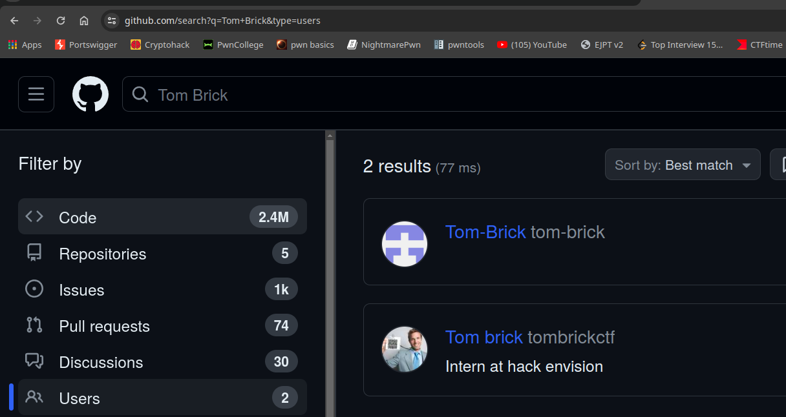
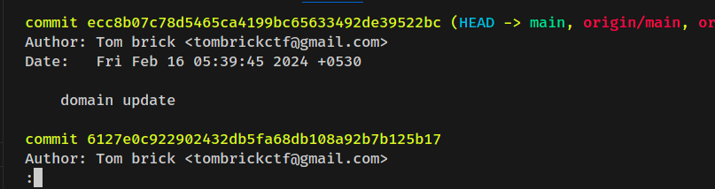

# Brick 1

#### Author: Gourav Suram
#### Description

> Tom brick is an Intern for us at hack envision, he's really good at his work, but we noticed he ignore security practices.  
>Your challenge is to find tom's gmail id
Flag format : quarkCTF{his-email-id}

# Writeup

- This is an easy task, you can use sherlock.py to find accounts of a username on various websites.
- The description provides hint that he's an `intern`.

- The next search should be on Github

- The second account is the one we want
- There's a public repo, let's clone it 

`git clone https://github.com/tombrickctf/company-portal`

- You can find email in git log.
- Enter `git log` when you are in the repo.

- Email : `tombrickctf@gmail.com`

#### Flag

`quarkCTF{tombrickctf@gmail.com}`

