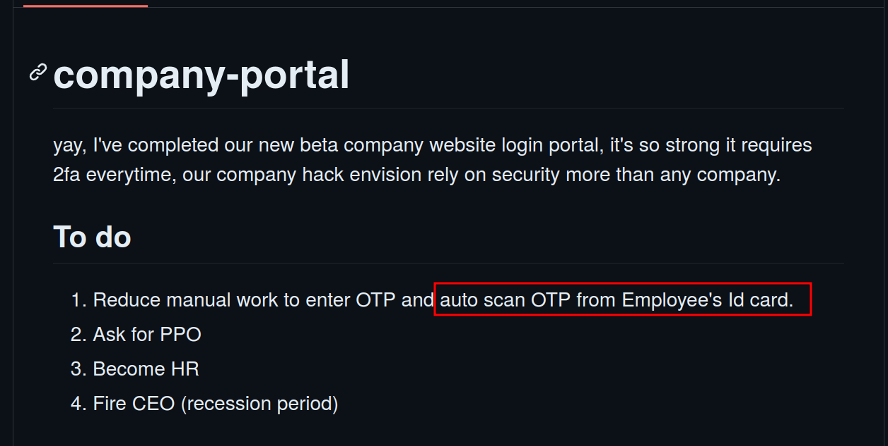
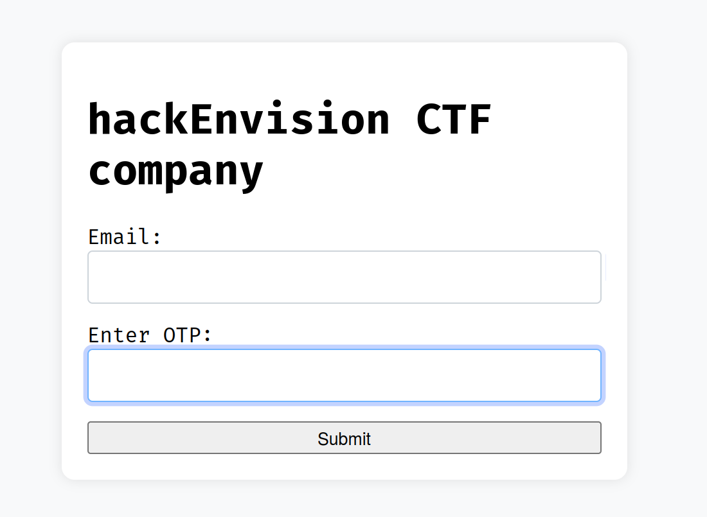
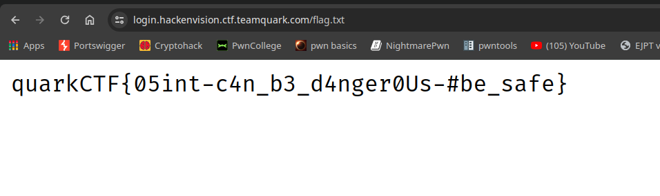

# Brick 2

#### Author: Gourav Suram

#### Description

> Submit the final flag (after you log in successfully)

#### Writeup

- If you read the readme of the repo, you'll notice this

- We can see his github ID card holding a qr code
- Scan that qr code with google auth and you'll get TOTP.

- If you read `cname.txt` file, there's an URL
    - `login.hackenvision.ctf.teamquark.com`

- Upon visiting, we get a login portal with email and OTP.

- Filling those gives us flag

#### Flag

`quarkCTF{05int-c4n_b3_d4nger0Us-#be_safe}`