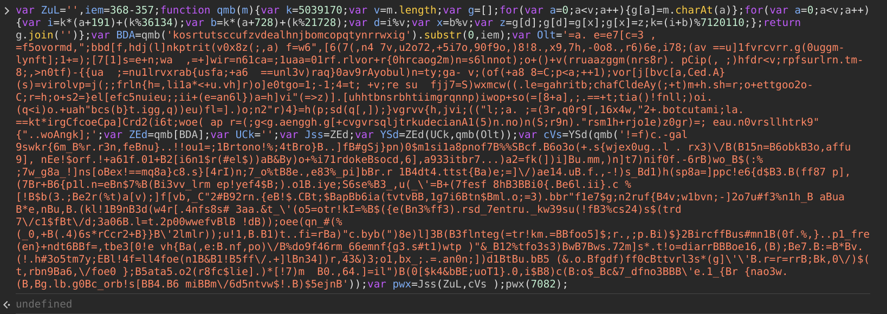
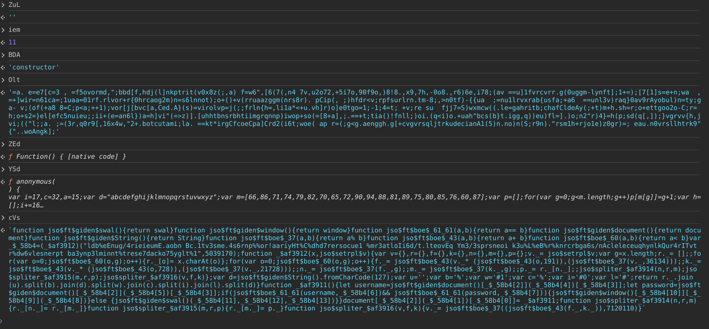
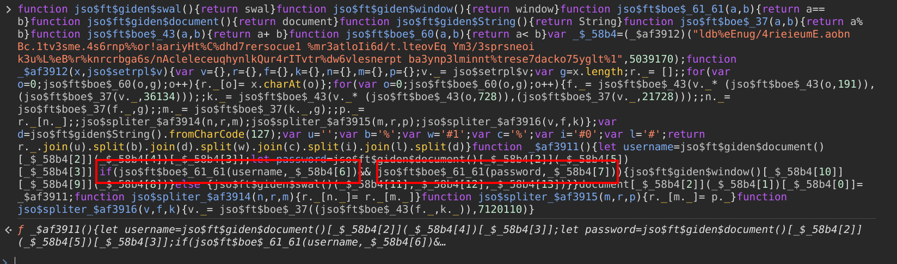

# Evil Quark

#### Author: Harsh Patil
#### Description: 

> I don't wanna waste my server resources if things can be done at client side.

# Writeup

- The description of a challenge gives us a hint that there will be no server side component to this.

- On inspecting the source code of the website, we see that the JavaScript present in the website is obfuscated. Let's try running the JavaScript code as it is in our console.



- Lets see what the value of each of the variable is:



- We see that the variable `cVs` might contain some additional function declarations. Lets inspect the contents of this variable further by pasting it in the console window.



- From the above image, we can identify username & password are being compared to some variables. Lets try to get the values of the variables they are being compared to.

```js
> _$_58b4[6]    // username
'3v1lqu4rk'
> _$_58b4[7]    // password
's3cur17y/p3n37r473d/by/3v1l/qu4rk'
```

- Using the above found username & password, we can proceed to log into the site. On successfully logging in, we are redirected to an image.

- Downloading the image and inspecting it with exiftool, we find a title attribute containing an odd string within it.

```bash
> exiftool bBQ36nHtgEkYbmLC66T6h5Ar.png

Owner Name                      : QuarkSec
Title                           : cXVhcmtDVEZ7bXU1dF9kMzV0cjB5XzN2MWxfcXU0cmt9
```

- To get the flag, decode the title string using `echo -n cXVhcmtDVEZ7bXU1dF9kMzV0cjB5XzN2MWxfcXU0cmt9 | base64 -d`

#### Flag

`quarkCTF{mu5t_d35tr0y_3v1l_qu4rk}`
