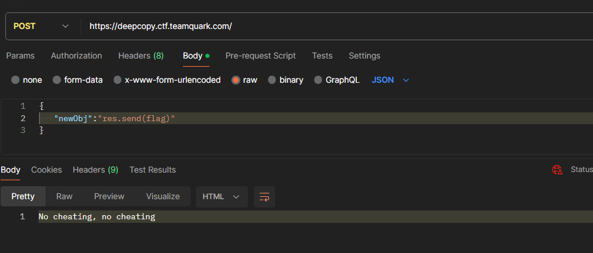
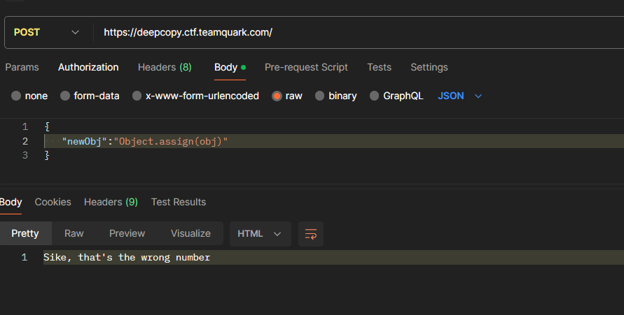
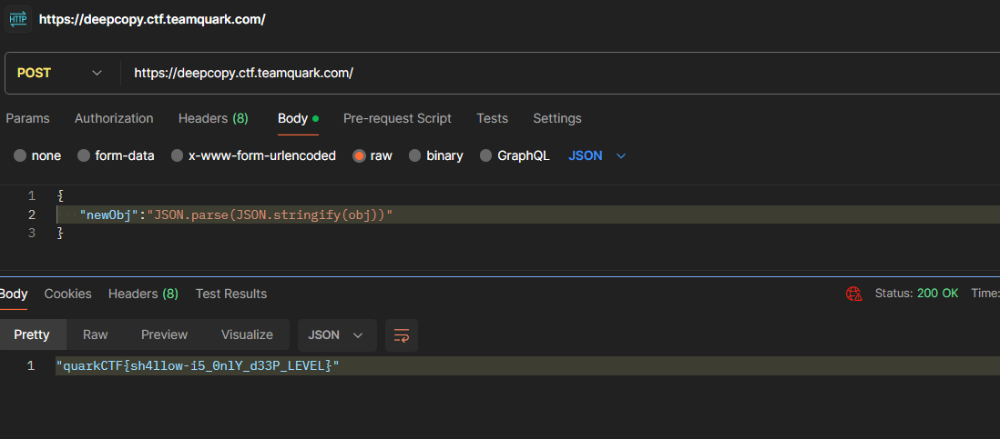

# Challenge name : Deepcopy
### Category : Web
### Authors: [Apoorva Pendse](https://github.com/apoorvapendse)


### Description

> Do you think you are good at node js? Here's a common mistake developers do, find it out, grab the flag ^^


# Writeup

Let's have a look at the source code. 

```javascript
//index.js

import express from "express";
import dotenv from "dotenv";
const app = express();
dotenv.config();

app.use(express.json());

let flag = process.env.FLAG;
// 
app.get("/", (req, res) => {
  res.json("Hello ");
});

app.post("/", (req, res) => {
  const obj = {
    name: "Quark",
    details: {
      flag: flag,
    },
  };

  if(req.body.newObj.indexOf("re")!==-1)
  {
    res.send("No cheating, no cheating")
  }
  let newObj;
  try {
    newObj = eval(req.body.newObj);
  } catch (error) {
    res.send("OOPS, Error occured :(");
  }

  obj.details.flag = "Sorry, smarty pants!";

  try {
    if (newObj.details.flag === flag) {
      res.json(flag);
    } else {
      res.send("Sike, that's the wrong number");
    }
  } catch (error) {
    res.send("OOPS, error occured :(");
  }
});

app.listen(process.env.PORT, () => {
  console.log("server running on port",process.env.PORT);
});
```


Looking at the 
```javascript
 if(req.body.newObj.indexOf("re")!==-1)
  {
    res.send("No cheating, no cheating")
  }
```

We can't directly get the flag by sending ```res.send(flag)``` as the payload, or even return something



sad...


If we send obj as the input. 

Then newObj will refer to the same object in the memory
and since 
 ```javascript  
obj.details.flag = "Sorry, smarty pants!";
```
This won't work, because newObj.details.flag will also become "Sorry, smarty pants!"

<hr>
Let's try using Object.assign() to create a copy 




Interesting...

<hr>

So it turns out that Object.assign() creates a ```shallow copy``` 

ie the copy created has only the top level properties with different references than the original object, but the nested properties all have the same ref.

**So we just need to create a deep copy**

Upon googling, this is the reference I found.

https://stackoverflow.com/questions/122102/what-is-the-most-efficient-way-to-deep-clone-an-object-in-javascript

The question itself is sufficient to get the flag



Flag: ```"quarkCTF{sh4llow-i5_0nlY_d33P_LEVEL}"```


