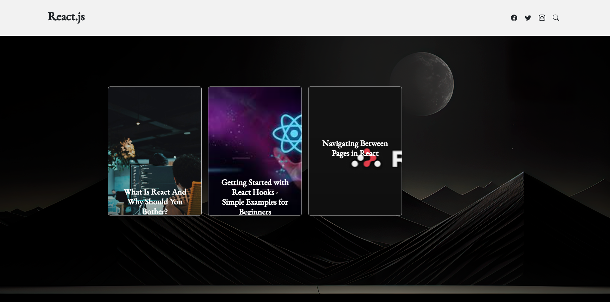
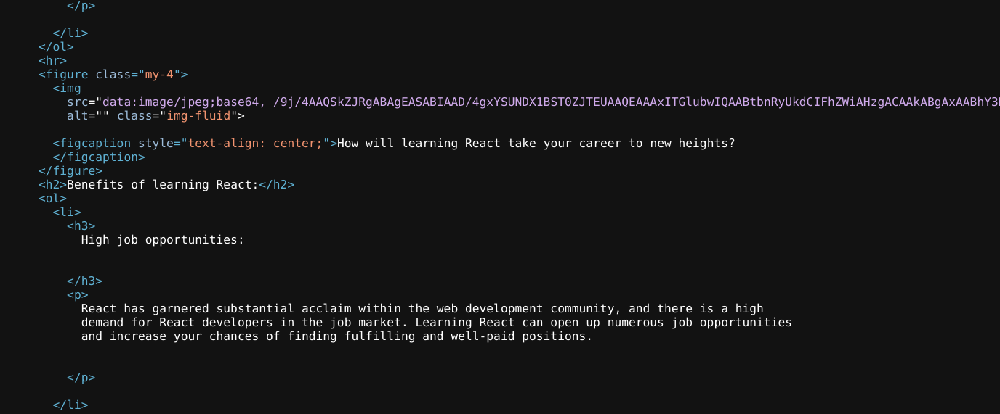

# Base64 heaven

#### Author: Harsh Patil
#### Description: 

> Can you find the hidden flag ??

# Writeup

- Lets take a look at the homepage of the site:



Opening any of the blog pages takes us to `/blogX.html` where X is the blog number.

- We see that all images used in the blog pages are base64 encoded strings rather than actual image URLs.



- Upon further inspection of each of the blog pages, we see that `/blog1.html` contains an img tag with width and height set to 0.

```html
<figure class="my-4">
    
</figure>
```

- To solve the challenge, just decode the above base64 string and the flag is revealed.

```bash
echo -n cXVhcmtDVEZ7YjY0XzE1bnRfM25jcnlwdDEwbn0= | base64 -d
```

#### Flag

`quarkCTF{b64_15nt_3ncrypt10n}`
