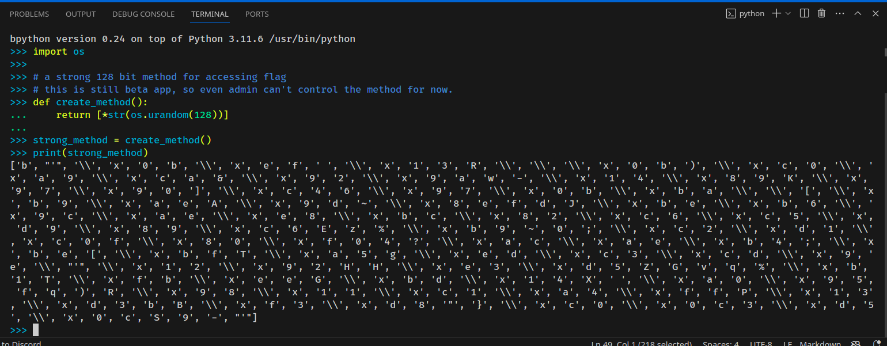

# cat: web
#### author: Gourav Suram

#### desc:

> We are planning to make our strong HTTP method for better security.

#### Writeup

- Upon visitng the index page we get src code of it.

```python

#!/usr/bin/env python3

from flask import Flask, request, Response
from api import strong_method 

app = Flask(__name__)

@app.route('/')
def index():
    return Response(open(__file__).read(), mimetype='text/plain')

#let's repalce get, post, etc
#we aim to create a strong method where only quark admins can access flag
@app.route('/flag', methods=strong_method)
def flag():
    return open('flag.txt').read()

@app.after_request
def hide_allowed(response):
    response.headers["Allow"] = ""
    return response

if __name__ == "__main__":
	app.run('0.0.0.0', 1337, debug=False)

```

- If you use flask reguarly you might know, it uses a list for having methods allowed on particular page
    - E.g (methods=['POST', 'GET'])

- On the challenge it's using `stron_method`
- Strong method code :

```python

import os

# a strong 128 bit method for accessing flag
# this is still beta app, so even admin can't control the method for now.
def create_method():
    return [*str(os.urandom(128))]

strong_method = create_method()

```

- Hmmmm, it's having a list of 128 bit key.
- since it's a list, and os.urandom returns byte string, we can use any value to get the flag.

- by running above code we can see this:



- now this list is the one flask refers to and allow them. (yes this many possible ways/methods the challenge can be solved with.)

- Solution


#### Flag

`quarkCTF{ig-that5_WHY_w3_h4v3_F1r3w4LL}`

