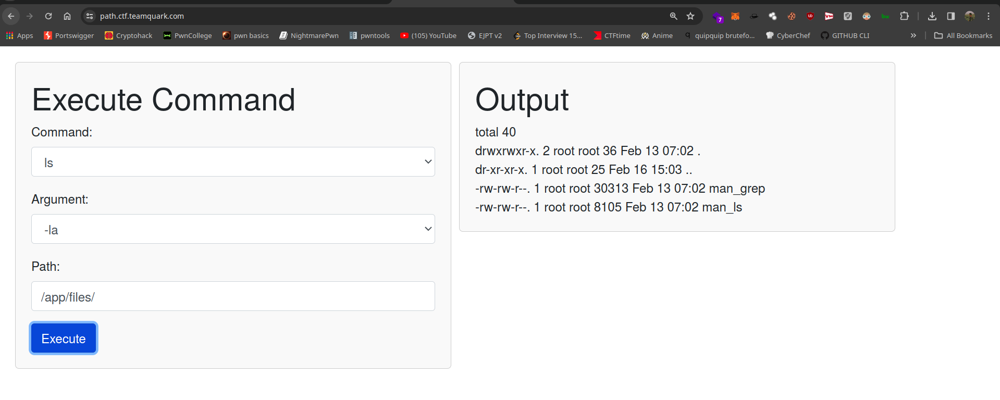

# Chall name: Path

#### Author: Gourav Suram
#### Desc:

> I am building my new minimal shell, can you test this before I complete and deploy on web.

# Writeup



- If I run the app with it's default argument, I get output, it's listing /app/files.
- But when I tried to list `/` dir I got error as `Path not allowed`
- Let's move to the src code.

- It's taking commands and passing it to valid commands function

```python

def is_valid_input(cmd, arg):
    allowed_cmds = ['ls', 'grep']
    if cmd in allowed_cmds and re.match(r'^[a-zA-Z0-9\s-]+$', arg):
        return True
    else:
        return False

```

- As we can see only 2 commands are allowed and it's also using regex to match our argument didn't  have any other characters used. (regex only allows alphanumeric and space and -)

- for the path it's going on:

```python

def is_valid_path(input_path):
    if input_path.startswith("/app/files/"):
        return True
    else:
        return False

```

- it checks if path starts with `/app/files` only.
- We can directory traversal this with: `/app/files/../../../../`

- But the problem is, grep dont use any argument specified in the app that can print out flag.
- What next? As long as we give input in arguments that matches in regex, we are good to go.


#### Soln

- Part 1. (here's our flag)


- Part 2. (Get the flag)
    - I'll simply change the value of arguments that satisfies the regex too.


- Part 3. (we got flag)


#### Flag

`quarkCTF{wh3n_w1LL-d3vlopERs_staRT_usING_besT_pr4ct1c35}`

