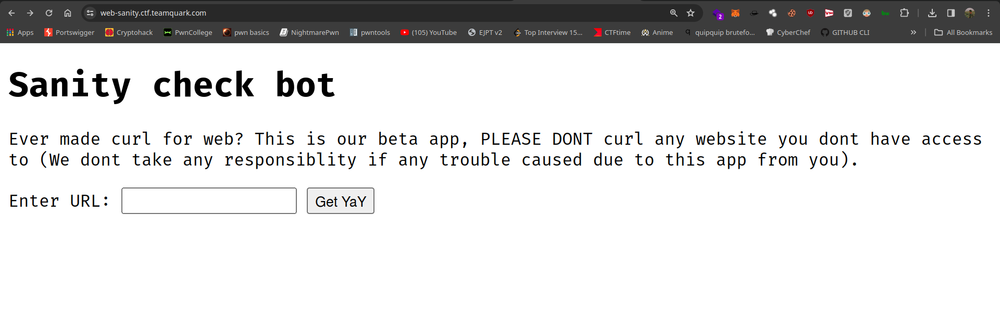
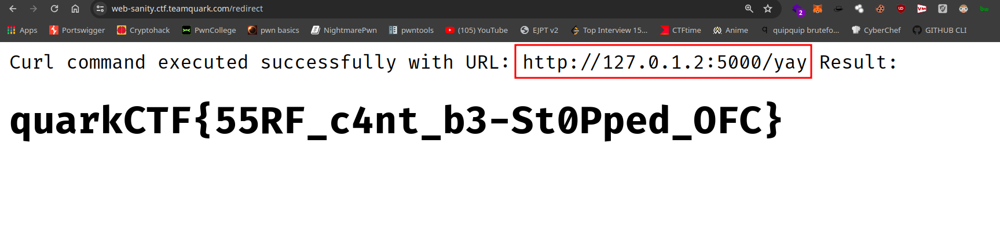

# Sanity

#### Author: Gourav Suram
#### Description: 

> My robot uses cURL to let you see source without using terminal.

# Writeup

- The homepage looks like this



Hmmm, so we can curl another webpages, the first thought that comes in mind in SSRF (Server side request forgery)

- Let's see source code

```python

    if not url.startswith('http://'):
        return "Please use http only (beta app)"

    for i in localhost:
        if url.split('//')[1].startswith(i):
            return "Nope, next time!!"

```
- At start we can see the website forces us to use http website only.
- Secondly it's using list slicing to see if your url (after http) starts with anything that's in the ban list
 
 ```python 
    localhost = ['127.0.0.1', '::1', 'localhost', '0.0.0.0', '2130706433', '01111111 . 00000000 . 00000000 . 00000001']
 ```

 - if all checks are cleared, it later curls the website

 ```python
    try:
        result = subprocess.check_output(['curl', url], text=True)
        return f"Curl command executed successfully with URL: {url}\nResult:\n{result}"
    except subprocess.CalledProcessError as e:
        return f"Error executing curl command with URL: {url}\nError: {e.output}"
```

#### Soln

- Since this is an easy challenge there are multiple ways we kept for users to solve this challenge.
- Like: we are banning `127.0.0.1` but not `127.0.0.2`....and likewise the whole subnet.


- You can simply use Ip address from `127.0.0.2` to `127.255.255.255` to get the flag
- Twist:
    - You simply can't use `http://127.0.0.2/yay` to get the flag. Why?
    - It's because of the port, if you read the `app.py`, the app is running on port 5000
    - `app.run('0.0.0.0', port=5000)`

- And now, by adding port you can get the flag:



#### Flag

`quarkCTF{55RF_c4nt_b3-St0Pped_OFC}`

